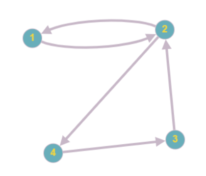

# Search Engine

Search Engine is a search tool designed to help users find relevant information from vast amounts of data on the internet.

The making of search engine is divided into 3 parts
- [x] Web Crawler
- [x] PageRank
- [x] Calculating TF-IDF score and cosine similarity

### Web Crawler

Currently, the web crawler uses a seed website and a depth to crawl the documents on the internet. It maintains following information in the database. 
```
CREATE TABLE websites (
    id UUID PRIMARY KEY DEFAULT uuid_generate_v4(),
    title VARCHAR(512) NOT NULL,
    description TEXT NOT NULL,
    url VARCHAR(2048) UNIQUE NOT NULL,
    word_count INT NOT NULL,
    rank INT NOT NULL
);

CREATE TABLE keywords (
    id UUID PRIMARY KEY DEFAULT uuid_generate_v4(),
    word VARCHAR(100) UNIQUE NOT NULL,
    unique_count BIGINT
);

CREATE TABLE website_keywords (
    id BIGSERIAL PRIMARY KEY,
    keyword_id UUID NOT NULL REFERENCES keywords (id),
    website_id UUID NOT NULL REFERENCES websites(id),
    count INT NOT NULL
);

CREATE TABLE edges (
    url1 UUID NOT NULL REFERENCES websites(id),
    url2 UUID NOT NULL REFERENCES websites(id),
    primary key (url1, url2)
);

CREATE TABLE edges_to_crawl (
    url1 VARCHAR(2048) NOT NULL,
    url2 VARCHAR(2048) NOT NULL,
    is_crawled boolean default false,
    primary key (url1, url2)
);

CREATE INDEX idx_keywords_name ON keywords (word);
CREATE INDEX website_keyword_id ON website_keywords (keyword_id);

```

### PageRank

After storing all the data, we need to assign the documents/websites a proper pagerank. For that we use a power iteration algorithm of pagerank. So using the **Edges** table, we create an **adjacency matrix** to represent it as a graph with directed links.

Note that the directed links is row to col.



The adjacency matrix would be as follows:
$$
\begin{equation} Adj = 
\begin{pmatrix}
    0 & 1 & 0 & 0  \\
    1 & 0 & 0 & 1 \\
    0 & 1 & 0 & 0 \\
    0 & 0 & 1 & 0
\end{pmatrix}
\end{equation}
$$

The following operation would be to divide the horizontal row by its' node outdegree. So the matrix becomes as follows:
$$
\begin{equation} M = 
\begin{pmatrix}
    0 & 1 & 0 & 0  \\
    0.5 & 0 & 0 & 0.5 \\
    0 & 1 & 0 & 0 \\
    0 & 0 & 1 & 0
\end{pmatrix}
\end{equation}
$$

Now the page rank equation is 
$$
\begin{equation}
    P_{i+1} = M \cdot P_i \cdot d + \frac{1-d}{N} \cdot J
\end{equation}
$$
```math
\begin{align*}
    & P_{i+1} \text{ is the PageRank vector for the next iteration (\(i+1\))} \\
    & P_i \text{ is the PageRank vector for the current iteration (\(i\))} \\
    & M \text{ is the transition / adjacency matrix shown above} \\
    & d \text{ is the damping factor} \\
    & N \text{ is the total number of web pages} \\
    & J \text{ is the vector of 1's}
\end{align*}
```

Now to check for the convergence of pageranks:
```javascript
export function is_similar(P:number[], Q:number[], delta:number):boolean {
    let sum = 0;
    for (let i=0; i<P.length; i++) {
        sum += Math.abs(P[i] - Q[i])
    }
    return sum <= delta;
}
```

Note that I have also normalize the pageranks to stay between 0 and 1, because otherwise it won't converge.

### TF IDF Score and Cosine Similarity
For calculating TF-IDF score and cosine similarity, I have majorly followed this article:

https://janav.wordpress.com/2013/10/27/tf-idf-and-cosine-similarity/

You can have a look at this. 

## Tasks to do
- [ ] Giving search term occurring together a bonus.
- [ ] Apply TF-IDF to title and description of the website.
- [ ] Consider how far the consecutive terms appear in the document
- [ ] Store content preview if description of the website not available
- [ ] Bug fixes, if any

## Installation
1. Install all the node packages.
```
npm install
```
2. To run the server
```
npm run server
```
3. To run crawler or pagerank
```
npm run start
```

## Contributing
Contributions are what make the open source community such an amazing place to learn, inspire, and create. Any contributions you make are greatly appreciated.

If you have a suggestion that would make this better, please fork the repo and create a pull request. You can also simply open an issue with the tag "enhancement". Don't forget to give the project a star! Thanks again!

1. Fork the Project
2. Create your Feature Branch (git checkout -b username)
3. Commit your Changes (git commit -m 'added some feature')
4. Push to the Branch (git push origin username)
5. Open a Pull Request

## License
This project is licensed under the ISC License - see the LICENSE.md file for details